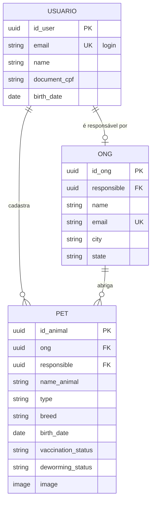

# Pet4lov 🐾

Plataforma de adoção de animais que conecta **ONGs de proteção animal** a pessoas interessadas em adotar. ONGs cadastram os pets disponíveis com informações de saúde (vacinação, vermifugação, condição geral) e os visitantes navegam pelo catálogo, filtram por espécie ou cidade e entram em contato com a ONG.


## Funcionalidades

- Cadastro e login com **JWT** (access + refresh), com renovação automática do token no front
- Catálogo público de pets com busca e filtros (espécie, ONG), página de detalhe e contato com a ONG
- Lista pública de ONGs parceiras
- Área logada ("Minha conta") para cadastrar a própria ONG e gerenciar os pets (criar, editar, remover, enviar foto)
- Regras de permissão no backend: qualquer pessoa pode ver; só o responsável altera ou remove sua ONG e seus pets
- Interface responsiva com estados de carregamento, vazio e erro

## Stack

| Camada | Tecnologia |
|---|---|
| Front-end | Angular 17 (standalone components, control flow, lazy loading), Bootstrap 5 (SCSS) |
| Back-end | Django 5, Django REST Framework, SimpleJWT, django-filter |
| Banco | PostgreSQL 14 (via Docker) |
| Qualidade | Testes com Django `APITestCase` e Jasmine/Karma, CI no GitHub Actions |

## Arquitetura

```
Pet4lov/
├── backend/
│   ├── adocao/          models, serializers, views, permissões e testes da API
│   └── adocao_pets/     settings e rotas principais
├── frontend/src/app/
│   ├── auth/            AuthService, interceptor (token + refresh) e guard
│   ├── pets/            listagem, detalhe, formulário e serviço de pets
│   ├── ongs/            listagem, formulário e serviço de ONGs
│   ├── users/           cadastro, "minha conta" e serviço de usuários
│   ├── login/           tela de login
│   └── shared/          utilitários (mensagens de erro da API, UFs)
├── docs/                imagens do README
└── docker-compose.yaml  PostgreSQL local
```

### Modelo de dados



Cada usuário pode ter no máximo uma ONG, e só pode cadastrar pets na própria ONG.

## Endpoints

| Método | Rota | Acesso | Descrição |
|---|---|---|---|
| POST | `/api/register/` | público | Cria usuário |
| POST | `/api/auth/obtain/` | público | Gera access e refresh token |
| POST | `/api/auth/refresh/` | público | Renova o access token |
| GET | `/api/usuarios/me/` | autenticado | Dados do usuário logado |
| GET/PATCH/DELETE | `/api/usuarios/{id}/` | o próprio usuário | Consulta, edita ou remove a conta |
| GET | `/api/ongs/?search=&responsible=&city=` | público | Lista ONGs |
| POST | `/api/ongs/` | autenticado | Cria ONG (responsável = usuário logado) |
| PATCH/DELETE | `/api/ongs/{id}/` | responsável | Edita ou remove a ONG |
| GET | `/api/pets/?search=&type=&ong=&responsible=` | público | Lista pets |
| POST | `/api/pets/` | responsável pela ONG | Cria pet (multipart, com foto) |
| PATCH/DELETE | `/api/pets/{id}/` | responsável | Edita ou remove o pet |

## Como rodar

**Pré-requisitos:** Python 3.10+, Node 18+ e Docker.

```bash
docker compose up -d

cd backend
python -m venv .venv
source .venv/bin/activate
pip install -r requirements.txt
cp .env.example .env
python manage.py migrate
python manage.py createsuperuser
python manage.py runserver
```

Em outro terminal:

```bash
cd frontend
npm install
npm start
```

A API sobe em `http://localhost:8000`, o admin em `http://localhost:8000/admin` e o front em `http://localhost:4200`.

## Testes

```bash
cd backend && python manage.py test
cd frontend && npm run test:ci
```

Os testes do backend cobrem cadastro, login, isolamento entre usuários e as regras de permissão de ONGs e pets. Os do frontend cobrem o fluxo de autenticação (serviço, interceptor com refresh e guard), a tela de login e a listagem de pets. Tudo roda no CI a cada push.

## Autora

Feito por [Naiara Rodrigues](https://github.com/naiarar).
