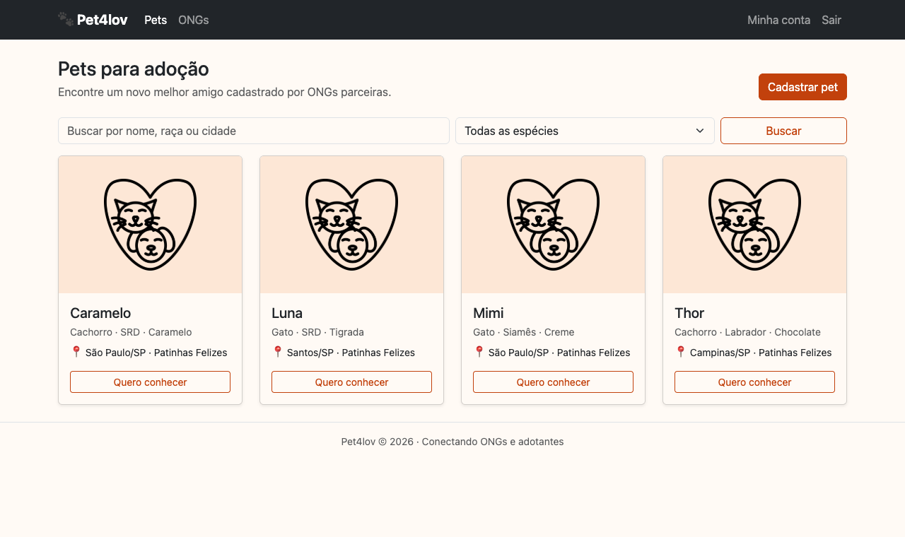

# Pet4lov 🐾

Plataforma de adoção de animais que conecta **ONGs de proteção animal** a pessoas interessadas em adotar. ONGs cadastram os pets disponíveis com informações de saúde (vacinação, vermifugação, condição geral), e os usuários navegam pelo catálogo.



## Funcionalidades

- Cadastro e login de usuários com **autenticação JWT** (access + refresh token)
- Cadastro de ONGs vinculadas a um responsável
- Cadastro de pets com foto, raça, cor, cidade/estado e histórico de saúde
- Rotas protegidas no front via guard e interceptor HTTP que injeta o token
- API REST completa (CRUD) para usuários, ONGs e pets

## Stack

| Camada | Tecnologia |
|---|---|
| Front-end | Angular 17 (standalone components, SSR), Bootstrap 5 |
| Back-end | Django 5, Django REST Framework, SimpleJWT |
| Banco | PostgreSQL 14 (via Docker) |

## Arquitetura

```
Pet4lov/
├── backend/           API Django
│   ├── adocao/        models, serializers e viewsets de Usuário, ONG e Pet
│   └── adocao_pets/   settings e rotas principais
├── frontend/          SPA Angular
│   └── src/app/
│       ├── auth/      guard, interceptor e serviço de autenticação
│       ├── ongs/      listagem e cadastro de ONGs
│       ├── pets/      listagem e cadastro de pets
│       └── users/     listagem e cadastro de usuários
├── schema.drawio      modelagem do banco
└── docker-compose.yaml
```

### Modelo de dados

- **Usuario**: usuário customizado (login por e-mail) com CPF, endereço e contato
- **ONG**: pertence a um Usuario responsável
- **Pet**: pertence a uma ONG e a um Usuario responsável, com foto e dados de saúde

## Endpoints

| Método | Rota | Descrição |
|---|---|---|
| POST | `/api/register/` | Cria usuário |
| POST | `/api/auth/obtain/` | Gera access e refresh token |
| POST | `/api/auth/refresh/` | Renova o access token |
| GET/POST/PUT/DELETE | `/api/usuarios/` | CRUD de usuários |
| GET/POST/PUT/DELETE | `/api/ongs/` | CRUD de ONGs |
| GET/POST/PUT/DELETE | `/api/pets/` | CRUD de pets |

## Como rodar

**Pré-requisitos:** Python 3.10+, Node 18+, Docker.

```bash
docker compose up -d

cd backend
python -m venv .venv
source .venv/bin/activate
pip install -r requirements.txt
cp .env.example .env
python manage.py migrate
python manage.py runserver
```

Em outro terminal:

```bash
cd frontend
npm install
npm start
```

A API sobe em `http://localhost:8000` e o front em `http://localhost:4200`.

## Testes

```bash
cd backend && python manage.py test
cd frontend && npm test
```

## Autora

Feito por [Naiara Rodrigues](https://github.com/naiarar).
